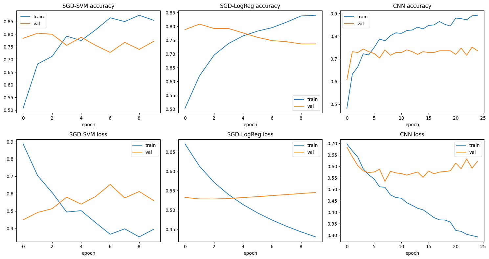

### 08/11/2026

* **Dataset Setup & Challenges (RSNA Knee):**
  * Downloaded RSNA 3D knee MRI data (~24,000+ slices, ~4,407 studies).
  * Early deletion/cleanup loops failed due to index-shift and null-handling issues (`IndexError`, `NaN` edge cases).
  * Manual expert ACL labels were limited (58 total studies: 34 intact, 24 torn), with no strong isolated ACL-tear subset.
  * Soft-label thresholding (`pseudo_ACL > 0.5`) produced severe imbalance (4,383 intact vs. 24 torn), making training unstable.

* **Pivot to Stanford MRNet:**
  * Switched from noisy pseudo-labeling to Stanford MRNet for cleaner supervised ACL targets.
  * Added MRNet-aligned image assets and metadata workflows to the project.
  * Began Redivis-based integration for split tables and ACL labels.

### 08/14/2026

* **Redivis Pipeline Stabilization:**
  * Updated MRNet loading to the current Redivis API pattern (`table.file(...).download(...)`).
  * Downloaded split metadata (`train`, `valid`) and ACL label tables (`train-acl`, `valid-acl`) into local project storage.
  * Implemented split-wise filtering by case ID so only files referenced by split ACL labels are retained.
  * Added safe preview mode for cleanup (`DELETE = False`) before destructive removal (`DELETE = True`).

* **Notebook Pipeline Update (ACL, Sagittal):**
  * Standardized training/evaluation on MRNet `train/valid` sagittal `.npy` volumes.
  * Added robust label loading (`case_id -> binary ACL label`) with flexible column inference.
  * Cached preprocessing outputs to `cache/preprocessed_*_sagittal.npz` for faster reruns.

* **Imbalance Handling:**
  * Added inverse-frequency class weighting for HOG models (via `sample_weight` in `SGDClassifier.partial_fit`).
  * Added inverse-frequency class weighting for CNN training (`class_weight` in `model.fit`).

* **CNN Simplification (Binary Setup):**
  * Replaced 2-logit softmax head with a 1-unit sigmoid output layer.
  * Switched loss to `binary_crossentropy`.
  * Switched prediction step from `argmax` to thresholding (`p >= 0.5`).

* **Reporting:**
  * Kept per-model classification reports.
  * Kept unified comparison table (accuracy / precision / recall / F1).
  * Kept side-by-side and individual confusion matrix plots.

* **Model comparison:**
```
     model  accuracy  precision   recall  f1_score
   SGD-SVM  0.621849   0.588235 0.555556  0.571429
SGD-LogReg  0.605042   0.555556 0.648148  0.598291
       CNN  0.714286   0.651515 0.796296  0.716667
```

### 08/24/2026

* **Reproducible, unbiased splits:**
  * Replaced the fixed train/test split with a pooled shuffle — every run now pools all available images and draws a fresh random 80% train / 20% test split, giving a more honest, less "lucky" read on generalization.

* **CNN training bug (image model was learning nothing):**
  * Diagnosed a layer that was collapsing almost all useful information out of each image before the model could use it — the CNN was effectively guessing (~coin-flip predictions) while appearing to train normally.
  * Removed the offending step so the model can actually learn from image features.

* **SVM / Logistic Regression training bug (frozen accuracy):**
  * Found both simpler models were sharing a single learning-rate setting with the CNN, sized far too small for them, which made their accuracy look flat across training.
  * Gave each model its own properly-scaled learning rate — both now show real improvement (and eventual overfitting) during training, as expected.

* **Proper hyperparameter tuning:**
  * Swept a range of settings per model (learning rate, training rounds, etc.) and scored each combination with k-fold cross-validation, keeping the best-performing combination per model.

* **Added k-fold cross-validation:**
  * Replaced single train/test evaluation with 5-fold CV — data is split into 5 groups, each model is trained and tested 5 times (holding out a different group each time), and results are aggregated across all 5 for a more reliable performance estimate.

* **Results (5-fold CV, mean ± std accuracy):**
  * SGD-SVM: 0.645 ± 0.050
  * SGD-LogReg: 0.680 ± 0.022
  * CNN: 0.685 ± 0.047

**What training looked like:**



**Results — out-of-fold, all folds combined:**

*SGD-SVM classification report*

| | Precision | Recall | F1-score | Support |
|---|---|---|---|---|
| Normal | 0.64 | 0.65 | 0.65 | 200 |
| Torn | 0.65 | 0.64 | 0.64 | 200 |
| **Accuracy** | | | **0.65** | 400 |
| Macro avg | 0.65 | 0.65 | 0.64 | 400 |
| Weighted avg | 0.65 | 0.65 | 0.64 | 400 |

*SGD-SVM confusion matrix (rows=true, cols=predicted)*

| | Pred: Normal | Pred: Torn |
|---|---|---|
| **True: Normal** | 130 | 70 |
| **True: Torn** | 72 | 128 |

*SGD-LogReg classification report*

| | Precision | Recall | F1-score | Support |
|---|---|---|---|---|
| Normal | 0.68 | 0.68 | 0.68 | 200 |
| Torn | 0.68 | 0.68 | 0.68 | 200 |
| **Accuracy** | | | **0.68** | 400 |
| Macro avg | 0.68 | 0.68 | 0.68 | 400 |
| Weighted avg | 0.68 | 0.68 | 0.68 | 400 |

*SGD-LogReg confusion matrix (rows=true, cols=predicted)*

| | Pred: Normal | Pred: Torn |
|---|---|---|
| **True: Normal** | 136 | 64 |
| **True: Torn** | 64 | 136 |

*CNN classification report*

| | Precision | Recall | F1-score | Support |
|---|---|---|---|---|
| Normal | 0.70 | 0.64 | 0.67 | 200 |
| Torn | 0.67 | 0.73 | 0.70 | 200 |
| **Accuracy** | | | **0.69** | 400 |
| Macro avg | 0.69 | 0.69 | 0.68 | 400 |
| Weighted avg | 0.69 | 0.69 | 0.68 | 400 |

*CNN confusion matrix (rows=true, cols=predicted)*

| | Pred: Normal | Pred: Torn |
|---|---|---|
| **True: Normal** | 128 | 72 |
| **True: Torn** | 54 | 146 |

### 08/31/2026

* **Reintroduced class balancing:**
  * The natural dataset is imbalanced (~79% Normal / 21% Torn), and a same-day run without any balancing produced degenerate results on the coronal view (SVM/CNN both collapsed to always predicting "Normal"). Reintroduced case-level class balancing — undersampling Normal down to match the Torn count (262 cases each, 524 pooled total) — before the train/test split, so the balanced ratio is preserved through the split, the inner tuning holdout, and every CV fold.
  * Preprocessing is otherwise unchanged: raw center-slice MRI pixels only (resize to 64×64, normalize to [0,1]), no HOG or other feature engineering.

* **Final optimized hyperparameters:**
  * SVM — Axial `C=10, rbf, gamma=0.01` · Coronal `C=1, rbf, gamma=auto` · Sagittal `C=0.1, linear`. LogReg — Axial `C=1, lbfgs` · Coronal `C=0.1, lbfgs` · Sagittal `C=0.1, liblinear`. CNN — Axial `lr=1e-3, epochs=8` · Coronal `lr=1e-4, epochs=8` · Sagittal `lr=1e-4, epochs=8` (epochs fixed at 8 for all views; SVM now tunes gamma alongside C/kernel).
  * All 9 final models (refit on the full 80% train pool) saved to `optimized_models/` (not committed to git).

* **Results (10-fold CV over the 80% train pool, mean ± std accuracy, vs. final evaluation on the untouched 20% test set):**

| Model | View | CV Accuracy | Test Accuracy | Test F1 |
|---|---|---:|---:|---:|
| SVM | Axial | 0.719 ± 0.057 | 0.676 | 0.676 |
| Logistic Regression | Axial | 0.666 ± 0.048 | 0.629 | 0.628 |
| CNN | Axial | 0.706 ± 0.051 | 0.657 | 0.655 |
| SVM | Coronal | 0.555 ± 0.050 | 0.514 | 0.503 |
| Logistic Regression | Coronal | 0.556 ± 0.067 | 0.581 | 0.581 |
| CNN | Coronal | 0.595 ± 0.039 | 0.571 | 0.571 |
| SVM | Sagittal | 0.643 ± 0.033 | 0.581 | 0.581 |
| Logistic Regression | Sagittal | 0.680 ± 0.047 | 0.581 | 0.580 |
| CNN | Sagittal | 0.689 ± 0.064 | 0.648 | 0.644 |

* **Findings:**
  * Best combination: **SVM — Axial** (CV accuracy 0.719, test accuracy 0.676, test F1 0.676) — narrowly ahead of CNN — Axial (0.657), after fixing a bug where `gamma` had been dropped from the SVM grid (below).
  * Best model by mean test accuracy: **CNN** (0.625), ahead of LogReg (0.597) and SVM (0.590) — SVM has the single best combo but its weak Coronal result drags its average down.
  * Best view by mean test accuracy: **Axial** (0.654), ahead of Sagittal (0.603) and Coronal (0.555, still weakest).
  * **Fixed SVM — Coronal's majority-class collapse:** it was predicting "Torn" for every test case (0.495 accuracy = the test set's Torn proportion, 0.00 precision/recall on Normal). Root cause: `gamma` had been dropped from `SVM_GRID` during an earlier simplification.
  * Sagittal shows the largest CV-vs-test gap (LogReg 0.099, SVM 0.061) — real overfitting signal on that view, unrelated to the SVM fix.
  * LogReg is byte-identical to the previous run (untouched, fully deterministic) — confirmed via the verification cell below.
  * Balancing removed an earlier majority-class-collapse failure mode too, at the cost of roughly halving the usable dataset (1248 → 524 pooled cases) — a real data-volume tradeoff, not a free improvement.

* **Fixed CNN epochs to 8:**
  * Simplified the CNN hyperparameter grid to fix `epochs=8` for every view (previously tuned over {10, 20}), leaving learning rate as the only tuned CNN hyperparameter. Applied consistently everywhere CNN training happens — tuning, training-curve plot, 10-fold CV, and the final saved model — so there's no mismatch between what was tuned and what was deployed.

* **Added a model-reload verification cell:**
  * New final cell reloads each of the 9 saved models directly from `optimized_models/` (not the in-memory objects from training) and re-evaluates them on the untouched 20% test set, asserting the reloaded predictions reproduce the exact `test_accuracy`/`test_precision`/`test_recall`/`test_f1` already in `results_df` — confirms the saved artifacts are trustworthy for later reuse. Also prints a full classification report per combo, reproduced below.

**Classification reports (reloaded models, evaluated once on the untouched 20% test set):**

*SVM — Axial*

| | Precision | Recall | F1-score | Support |
|---|---|---|---|---|
| Normal | 0.68 | 0.68 | 0.68 | 53 |
| Torn | 0.67 | 0.67 | 0.67 | 52 |
| **Accuracy** | | | **0.68** | 105 |
| Macro avg | 0.68 | 0.68 | 0.68 | 105 |
| Weighted avg | 0.68 | 0.68 | 0.68 | 105 |

*Logistic Regression — Axial*

| | Precision | Recall | F1-score | Support |
|---|---|---|---|---|
| Normal | 0.63 | 0.64 | 0.64 | 53 |
| Torn | 0.63 | 0.62 | 0.62 | 52 |
| **Accuracy** | | | **0.63** | 105 |
| Macro avg | 0.63 | 0.63 | 0.63 | 105 |
| Weighted avg | 0.63 | 0.63 | 0.63 | 105 |

*CNN — Axial*

| | Precision | Recall | F1-score | Support |
|---|---|---|---|---|
| Normal | 0.64 | 0.74 | 0.68 | 53 |
| Torn | 0.68 | 0.58 | 0.62 | 52 |
| **Accuracy** | | | **0.66** | 105 |
| Macro avg | 0.66 | 0.66 | 0.65 | 105 |
| Weighted avg | 0.66 | 0.66 | 0.65 | 105 |

*SVM — Coronal*

| | Precision | Recall | F1-score | Support |
|---|---|---|---|---|
| Normal | 0.53 | 0.36 | 0.43 | 53 |
| Torn | 0.51 | 0.67 | 0.58 | 52 |
| **Accuracy** | | | **0.51** | 105 |
| Macro avg | 0.52 | 0.52 | 0.50 | 105 |
| Weighted avg | 0.52 | 0.51 | 0.50 | 105 |

*Logistic Regression — Coronal*

| | Precision | Recall | F1-score | Support |
|---|---|---|---|---|
| Normal | 0.59 | 0.55 | 0.57 | 53 |
| Torn | 0.57 | 0.62 | 0.59 | 52 |
| **Accuracy** | | | **0.58** | 105 |
| Macro avg | 0.58 | 0.58 | 0.58 | 105 |
| Weighted avg | 0.58 | 0.58 | 0.58 | 105 |

*CNN — Coronal*

| | Precision | Recall | F1-score | Support |
|---|---|---|---|---|
| Normal | 0.57 | 0.58 | 0.58 | 53 |
| Torn | 0.57 | 0.56 | 0.56 | 52 |
| **Accuracy** | | | **0.57** | 105 |
| Macro avg | 0.57 | 0.57 | 0.57 | 105 |
| Weighted avg | 0.57 | 0.57 | 0.57 | 105 |

*SVM — Sagittal*

| | Precision | Recall | F1-score | Support |
|---|---|---|---|---|
| Normal | 0.59 | 0.55 | 0.57 | 53 |
| Torn | 0.57 | 0.62 | 0.59 | 52 |
| **Accuracy** | | | **0.58** | 105 |
| Macro avg | 0.58 | 0.58 | 0.58 | 105 |
| Weighted avg | 0.58 | 0.58 | 0.58 | 105 |

*Logistic Regression — Sagittal*

| | Precision | Recall | F1-score | Support |
|---|---|---|---|---|
| Normal | 0.60 | 0.53 | 0.56 | 53 |
| Torn | 0.57 | 0.63 | 0.60 | 52 |
| **Accuracy** | | | **0.58** | 105 |
| Macro avg | 0.58 | 0.58 | 0.58 | 105 |
| Weighted avg | 0.58 | 0.58 | 0.58 | 105 |

*CNN — Sagittal*

| | Precision | Recall | F1-score | Support |
|---|---|---|---|---|
| Normal | 0.69 | 0.55 | 0.61 | 53 |
| Torn | 0.62 | 0.75 | 0.68 | 52 |
| **Accuracy** | | | **0.65** | 105 |
| Macro avg | 0.65 | 0.65 | 0.64 | 105 |
| Weighted avg | 0.66 | 0.65 | 0.64 | 105 |