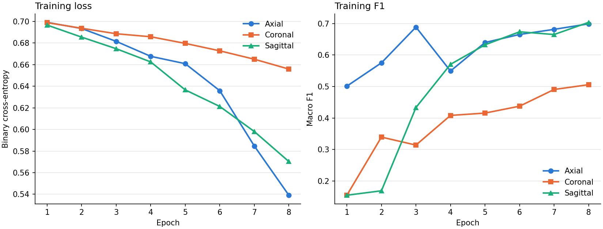
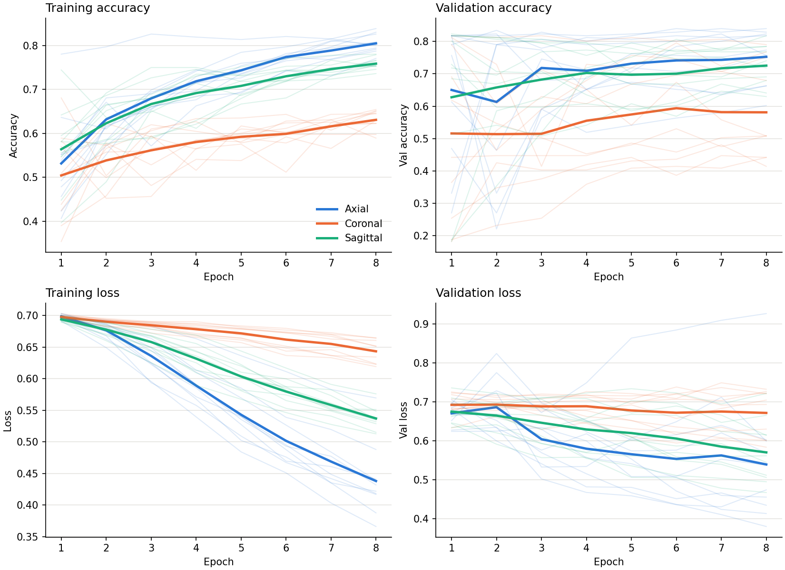

### 08/11/2026

- **Dataset Setup & Challenges:**
  - Initially used RSNA 3D knee MRI data (~24,000+ slices, ~4,407 studies).
  - ACL labels were limited to 58 studies (34 intact, 24 torn).
  - Soft-label filtering produced extreme imbalance (4,383 intact vs. 24 torn), making training unreliable.

- **Pivot to Stanford MRNet:**
  - Switched to Stanford MRNet for cleaner, supervised ACL labels.
  - Began integrating MRNet MRI data and ACL label metadata.

### 08/14/2026

- **Data Pipeline:**
  - Set up automated MRNet downloading and case-ID filtering.
  - Standardized ACL classification as binary: normal vs. torn.
  - Added preprocessing and caching for faster experiments.

- **Initial Model Results:**

| Model | Accuracy | Precision | Recall | F1 |
|---|---:|---:|---:|---:|
| SGD-SVM | 0.622 | 0.588 | 0.556 | 0.571 |
| SGD-LogReg | 0.605 | 0.556 | 0.648 | 0.598 |
| CNN | **0.714** | **0.652** | **0.796** | **0.717** |

- CNN performed best in the initial experiment.

### 08/24/2026

- **Model Improvements:**
  - Fixed issues that prevented the CNN, SVM, and Logistic Regression models from learning effectively.
  - Added model-specific training settings.
  - Added hyperparameter tuning.
  - Added 5-fold cross-validation.

- **5-Fold Results:**

| Model | Mean Accuracy | Std. Dev. |
|---|---:|---:|
| SGD-SVM | 0.645 | 0.050 |
| SGD-LogReg | 0.680 | 0.022 |
| CNN | **0.685** | 0.047 |

- **Out-of-Fold Results:**

| Model | Accuracy | Normal F1 | Torn F1 |
|---|---:|---:|---:|
| SGD-SVM | 0.65 | 0.65 | 0.64 |
| SGD-LogReg | 0.68 | 0.68 | 0.68 |
| CNN | **0.69** | 0.67 | **0.70** |

### 08/31/2026

- **Class Balancing:**
  - Balanced the training data because the natural dataset was approximately 79% Normal / 21% Torn.
  - Undersampled the Normal class to match the Torn class.

- **Preprocessing:**
  - Used raw MRI pixel data only.
  - Center slice resized to 64×64 grayscale and normalized to [0,1].
  - No HOG or additional feature engineering.

- **Model Expansion:**
  - Tested 3 models across all 3 MRI views:
    - SVM
    - Logistic Regression
    - CNN
  - Tuned each model separately for each view.
  - Saved all 9 optimized models.

- **10-Fold Results:**

| Model | View | Test Accuracy | Test F1 |
|---|---|---:|---:|
| SVM | Axial | **0.676** | **0.676** |
| LogReg | Axial | 0.629 | 0.628 |
| CNN | Axial | 0.657 | 0.655 |
| SVM | Coronal | 0.514 | 0.503 |
| LogReg | Coronal | 0.581 | 0.581 |
| CNN | Coronal | 0.571 | 0.571 |
| SVM | Sagittal | 0.581 | 0.581 |
| LogReg | Sagittal | 0.581 | 0.580 |
| CNN | Sagittal | 0.648 | 0.644 |

- **Key Findings:**
  - Best individual model: **Axial SVM** (67.6% test accuracy, 67.6% F1).
  - Best MRI view: **Axial** (65.4% average test accuracy).
  - Coronal was consistently the weakest view.
  - CNN performed particularly well on sagittal images (64.8% test accuracy, 64.4% F1).
  - The best cross-validation result was the Axial SVM at **71.9% ± 5.7%**.
  - Sagittal models showed noticeable CV-to-test performance drops, suggesting some overfitting.
  - Fixed a bug in the SVM hyperparameter search where `gamma` had previously been omitted.
  - Fixed CNN training to consistently use 8 epochs across tuning, CV, and final training.
  - Verified that reloaded saved models reproduce the original test results exactly.

### 09/07/2026

- **Dataset Validation:**
  - Removed class balancing to preserve the natural training distribution.
  - Verified that only labeled cases are included and that axial, coronal, and sagittal views contain matching case IDs.
  - Dropped the Stanford `valid_acl_labels.csv`/`StanfordMRNet/valid` split entirely — it's no longer read anywhere in the pipeline. `main.ipynb` now loads only `train_acl_labels.csv`/`StanfordMRNet/train`, and carves its own stratified case-level 80/20 train/test split out of that single pool (`random_state=SEED`), with the inner tuning split further carved from the 80% train side.

- **Final Dataset (train-only pool, self-split 80/20):**

| Split | Normal | Torn | Total |
|---|---:|---:|---:|
| Train | 738 | 166 | 904 |
| Test | 184 | 42 | 226 |
| Inner Train | 590 | 133 | 723 |
| Inner Holdout | 148 | 33 | 181 |

- All 1,130 labeled cases in `train_acl_labels.csv` have a matching MRI file for every view, so nothing is excluded.
- No unlabeled MRI images are included.
- No class balancing, oversampling, or undersampling is used on the dataset itself.

- **Pipeline & Imbalance Handling Rework:**
  - Replaced case-level undersampling (which had thrown away over half the data to force a 50/50 split) with `class_weight="balanced"` instead, so SVM, Logistic Regression, and CNN now train on the full, naturally-imbalanced pool (~82% Normal / 18% Torn) and compensate via per-class loss weighting rather than dropping data.
  - Added a `StandardScaler` step before SVM and Logistic Regression (`sklearn.pipeline.make_pipeline`), since raw flattened pixel features were previously fed in unscaled.
  - CNN now computes fold-specific and final `class_weight` via `sklearn.utils.class_weight.compute_class_weight("balanced", ...)` instead of training unweighted.
  - Model/view selection now uses CV metrics only — the test set is no longer looked at when picking the best combo (previously the writeup also reported "best combo by test F1", which peeks at the held-out set).
  - Simplified the Redivis download cell (removed unused label-inference helpers; case filtering now reads the headerless CSVs directly).

- **10-Fold CV Results (train-only 80/20 split, class-weighted):**

| Model | View | CV Accuracy | CV F1 | Test Accuracy | Test F1 |
|---|---|---:|---:|---:|---:|
| SVM | Axial | 0.537 | 0.502 | 0.535 | 0.508 |
| LogReg | Axial | 0.759 | 0.590 | **0.783** | 0.638 |
| CNN | Axial | 0.683 | 0.619 | 0.717 | 0.654 |
| SVM | Coronal | 0.480 | 0.441 | 0.323 | 0.323 |
| LogReg | Coronal | 0.722 | 0.550 | 0.637 | 0.474 |
| CNN | Coronal | 0.551 | 0.490 | 0.535 | 0.494 |
| SVM | Sagittal | **0.812** | 0.634 | 0.792 | 0.640 |
| LogReg | Sagittal | 0.785 | 0.642 | 0.748 | 0.608 |
| CNN | Sagittal | 0.725 | **0.645** | 0.690 | 0.629 |

- **Key Findings:**
  - Best combo by CV F1 (CV-only selection): **CNN — Sagittal** (CV accuracy 0.725, CV F1 0.645); test result was 0.690 accuracy / 0.629 F1.
  - Best model by mean CV accuracy: **Logistic Regression**. Best view by mean CV accuracy: **Sagittal**.
  - Least stable across folds: **SVM — Coronal** (fold accuracy std 0.208) — Coronal remains the weakest, most volatile view.
  - Scaling features before SVM/LogReg and switching to `class_weight="balanced"` avoided the earlier majority-class collapse (seen 08/31 on Coronal) without discarding any data.
  - Verified all 9 reloaded models from `optimized_models/` reproduce their reported test accuracy exactly.
  - Not directly comparable to 08/31's undersampled results: the pool size, class ratio, and test-set source all changed at once.
### 09/20/2026

- **Evaluation Change (CV-only):**
  - Removed all test-set metrics from `main.ipynb`. No model is scored on the held-out test cases anymore.
  - All reported numbers are 10-fold stratified CV (out-of-fold) on the same 904-case train pool as 09/07, macro-averaged: accuracy, F1, precision, recall.
  - Model/view selection still uses CV only.
  - Models, hyperparameters, class weighting (`class_weight="balanced"`), 8 epochs and batch size 16 are unchanged from 09/07. All models were retrained in a fresh run.

- **10-Fold CV Results (904-case train pool, class-weighted):**

| Model | View | Accuracy | F1 | Precision | Recall |
|---|---|---:|---:|---:|---:|
| SVM | Axial | 0.537 | 0.502 | 0.570 | 0.616 |
| LogReg | Axial | 0.759 | 0.590 | 0.592 | 0.589 |
| CNN | Axial | 0.683 | 0.619 | 0.629 | 0.708 |
| SVM | Coronal | 0.480 | 0.441 | 0.514 | 0.523 |
| LogReg | Coronal | 0.722 | 0.550 | 0.549 | 0.552 |
| CNN | Coronal | 0.551 | 0.490 | 0.533 | 0.555 |
| SVM | Sagittal | **0.812** | 0.634 | **0.669** | 0.619 |
| LogReg | Sagittal | 0.785 | 0.642 | 0.642 | 0.642 |
| CNN | Sagittal | 0.725 | **0.645** | 0.639 | **0.710** |

- **CNN Training Curves (training loss + training F1, final fit on the 904-case train pool, before CV):**

  - Training loss falls steadily over the 8 epochs for all views: Axial ≈ 0.70 → 0.54, Sagittal ≈ 0.70 → 0.57, Coronal ≈ 0.70 → 0.66.
  - Training F1 (macro, computed on the full 904-case train pool at the end of each epoch) ends at ≈ 0.70 for Axial and Sagittal and ≈ 0.51 for Coronal.
  - Coronal barely learns (loss nearly flat, training F1 ≈ 0.51 at epoch 8), which matches its weak CV result (0.551 accuracy / 0.490 F1).
  - Axial's training F1 is noisy early on (≈ 0.69 at epoch 3, dipping to ≈ 0.55 at epoch 4) because of the class-weighted loss. All views are still improving at epoch 8.
  - Curve values for F1 and loss were read from the plot, not logged to a file.

- **Key Findings:**
  - Best combo by CV F1: **CNN — Sagittal** (accuracy 0.725, F1 0.645, recall 0.710).
  - Best model by mean CV accuracy: **Logistic Regression**. Best view by mean CV accuracy: **Sagittal**.
  - SVM — Sagittal has the highest accuracy (0.812), but this is about the majority-class rate (738 / 904 = 0.816 are Normal), and its F1 (0.634) is below the CNN's. Accuracy alone overstates it.
  - Least stable across folds: **SVM — Coronal** (fold accuracy std 0.208).
  - Sagittal is the best view for all three models on F1.

### 09/30/2026

- **Validation Method Change (Monte Carlo CV):**
  - The 09/20 evaluation used `StratifiedKFold(n_splits=10)`, which partitions the 904-case train pool into 10 fixed, non-overlapping folds — each validation fold is only ~10% of the pool (~90 cases, ~16 Torn), which is why fold-to-fold accuracy swung so much.
  - Replaced it with repeated random 80/20 holdout validation: 10 repeats, each drawing a fresh stratified 80/20 split of the train pool with its own seed (`SEED, SEED+1, ..., SEED+9`). Every validation set is now the full 20% (~181 cases, ~33 Torn), and the 10 repeats are independent resamples rather than a fixed partition.
  - Applied the same fix to the CNN learning-rate tuning step, which had been fit once on a single fixed inner-train/inner-holdout split; it now also resamples 10 fresh 80/20 splits (with the same class weighting, epochs, and batch size as the CV cell) before a learning rate is chosen.
  - All CNN training (tuning, per-repeat CV, and final fit) now consistently uses 8 epochs / batch size 16.

- **Metrics:**
  - Added precision and recall for the CNN (previously only accuracy and F1 were tracked for it). All three models now report accuracy, precision, recall, and F1 — each as mean ± std over the 10 repeats.

- **Cleanup:**
  - Removed model saving entirely (`joblib.dump`, `final_model.save`, `optimized_models/`) — `main.ipynb` no longer writes any model artifacts to disk; it's purely for evaluating metrics.
  - Removed the now-dead `inner_train`/`inner_holdout` split and the `TrainF1` callback/`cnn_histories` tracking (the latter ran a full 904-image prediction after every epoch, for every view, to feed a plot that had already been removed).
  - Removed unused imports (`StratifiedKFold`, `classification_report`, `confusion_matrix`).
  - Deleted the stale `optimized_models/` files left over from an earlier interrupted run.
  - Verified the full notebook executes top to bottom with no errors after all of the above.

- ** Results (904-case train pool, class-weighted, mean ± std over 10 repeats):**

| Model | View | Accuracy | Precision | Recall | F1 |
|---|---|---:|---:|---:|---:|
| SVM | Axial | 0.524 ± 0.042 | 0.573 ± 0.018 | 0.617 ± 0.029 | 0.493 ± 0.031 |
| LogReg | Axial | 0.759 ± 0.021 | 0.597 ± 0.036 | 0.598 ± 0.036 | 0.595 ± 0.035 |
| CNN | Axial | 0.752 ± 0.079 | 0.658 ± 0.054 | 0.691 ± 0.047 | 0.655 ± 0.062 |
| SVM | Coronal | 0.775 ± 0.107 | 0.538 ± 0.156 | 0.505 ± 0.017 | 0.469 ± 0.033 |
| LogReg | Coronal | 0.703 ± 0.025 | 0.537 ± 0.029 | 0.542 ± 0.034 | 0.538 ± 0.031 |
| CNN | Coronal | 0.581 ± 0.141 | 0.540 ± 0.033 | 0.544 ± 0.040 | 0.484 ± 0.065 |
| SVM | Sagittal | **0.813 ± 0.018** | **0.668 ± 0.043** | 0.616 ± 0.039 | 0.630 ± 0.040 |
| LogReg | Sagittal | 0.789 ± 0.018 | 0.646 ± 0.027 | 0.643 ± 0.025 | 0.643 ± 0.024 |
| CNN | Sagittal | 0.725 ± 0.061 | 0.634 ± 0.030 | **0.681 ± 0.020** | **0.633 ± 0.040** |

- Overall (averaged across all 9 model/view combos): accuracy 0.714, precision 0.599, recall 0.604, F1 0.571.

- **CNN Repeat-Holdout Curves (accuracy, val_accuracy, loss, val_loss across the 8 epochs, 10 repeats/view):**

  - Each panel shows all 10 per-repeat curves faintly plus the mean curve in bold, per view.
  - Axial and Sagittal's mean val_accuracy climbs steadily (≈0.61 → ≈0.75-0.76); Coronal's stays flat around 0.51-0.6 the whole time — matching its weak CV result.
  - Individual repeats swing far more than the mean line, especially early on — expected given each validation set is only ~181 cases (~33 Torn), so a handful of cases shifts accuracy by several points.

- **Key Findings:**
  - Results are close to 09/20's fold-based numbers, which is reassuring: the validation-method fix didn't change *what* the numbers say, just made them more trustworthy (full 20% validation sets, resampled independently, instead of shrinking to 10% fixed folds).
  - Best combo by F1: **CNN — Sagittal** (F1 0.633, recall 0.681). Best combo by accuracy: **SVM — Sagittal** (0.813), but again mostly tracking the 0.816 majority-class rate — its F1 (0.630) trails CNN — Sagittal.
  - Coronal remains the weakest, most unstable view across every model (highest std on accuracy for SVM and CNN alike).
  - `main.ipynb` no longer produces any saved model files — it's an evaluation-only notebook as of this entry.
